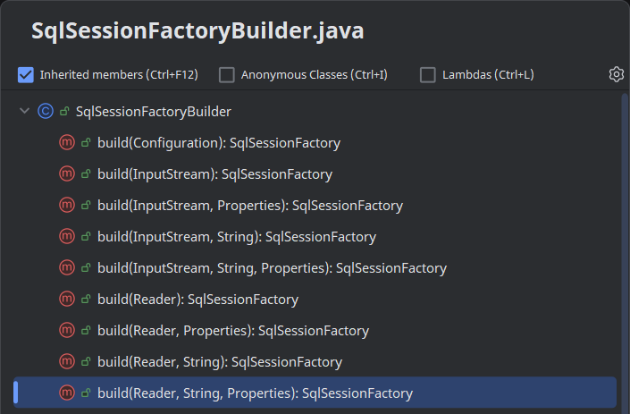

​	Mybatis 有两个核心配置，全局配置会影响 Mybatis 的执行；Mapper 配置定义了查询的 SQL，下面我们来看看 Mybatis 是如何加载配置文件的。

​	准备案例进行分析，主要示例代码如下：

```java
public static void main(String[] args) throws Exception {
    // 加载配置文件
    InputStream inputStream = Resources.getResourceAsStream("mybatis-config.xml");

    // 获取 SqlSessionFactory
    SqlSessionFactory sessionFactory = new SqlSessionFactoryBuilder()
        .build(inputStream);

    // 获取 SqlSession
    SqlSession sqlSession = sessionFactory.openSession();
    
	// 查询用户
    UserMapper userMapper = sqlSession.getMapper(UserMapper.class);
    User user = userMapper.selectUserById("101");
    System.out.println("user = " + user);
}
```

## 1. 构建 SqlSessionFactory 对象

​	构建 SqlSessionFactory 对象，其实是通过 SqlSessionFactoryBuilder 构建的，代码如下：

```java
SqlSessionFactory sessionFactory = new SqlSessionFactoryBuilder()
        .build(inputStream);
```

​	创建 SqlSessionFactoryBuilder 对象，然后使用建造者模式构建 SqlSessionFactory。建造者模式用于构建复杂对象，无需关注内部细节。



SqlSessionFactoryBuilder 中用来创建 SqlSessionFactory 对象的方法是 build()，build() 方法有 9 个重载，可以用不同的方法来创建 SqlSessionFactory 对象。**SqlSessionFactory 对象默认是单例的**。

SqlSessionFactoryBuilder#build() 核心代码（删减）：

```java
public SqlSessionFactory build(InputStream inputStream, String environment, Properties properties) {
    // 获取 XML 配置解析器 XMLConfigBuilder: 将配置文件加载到内存中并生成一个 document 对象, 同时初始化 Configuration 对象
    XMLConfigBuilder parser = new XMLConfigBuilder(inputStream, environment, properties);
    
    // 解析配置并创建 SqlSessionFactory 对象
    return build(parser.parse());
  }
```

## 2. 创建 XMLConfigBuilder 对象

​	XMLConfigBuilder 对象是 BaseBuilder 的子类，用于解析全局配置文件。


BaseBuilder 主要处理解析工作，类图如上所示。主要的子类及解析功能如下：

- `XMLMapperBuilder`：解析 Mapper 映射器。
- `XMLStatementBuilder`：解析 select、update、insert、delete 标签里的 SQL 语句。
- `XMLScriptBuilder`：解析动态 SQL。
- `XMLConfigBuilder`：解析 mybatis-config.xml 配置文件 或 全局配置文件。

### 2.1 XMLConfigBuilder 初始化

​	上面的其他三个解析处理类将在后续执行流程中会提及，先看下 XMLConfigBuilder 对象在初始化时的处理。

```java
// 构造函数
public XMLConfigBuilder(InputStream inputStream, String environment, Properties props) {
    this(Configuration.class, inputStream, environment, props);
}

public XMLConfigBuilder(Class<? extends Configuration> configClass, InputStream inputStream, String environment,
                        Properties props) {
    this(configClass, new XPathParser(inputStream, true, props, new XMLMapperEntityResolver()), environment, props);
}

// 最终执行的构造函数
private XMLConfigBuilder(Class<? extends Configuration> configClass, XPathParser parser, String environment,
                         Properties props) {
    // 调用父类构造函数, 初始化 configuration 对象
    super(newConfig(configClass));
    ErrorContext.instance().resource("SQL Mapper Configuration");
    
    // 将 Properties 全部设置到 configuration 对象中
    this.configuration.setVariables(props);
    
    // 设置是否解析的标志为 false
    this.parsed = false;
    
    // 初始化 environment
    this.environment = environment;
    
    // 初始化解析器
    this.parser = parser;
}
```

#### 2.1.1 XPathParser 初始化

​	XPathParser 实际上是 Mybatis 全局配置文件解析器。XPathParser#XPathParser() 核心代码如下：

```java
// XPathParser 构造函数, XPath 对象为 XPathFactory 对象
  public XPathParser(InputStream inputStream, boolean validation, Properties variables) {
    // 初始化 XPathParser 相关属性
    commonConstructor(validation, variables, null);
    // 初始化 document, DocumentBuilderFactory 对象
    this.document = createDocument(new InputSource(inputStream));
  }

private void commonConstructor(boolean validation, Properties variables, EntityResolver entityResolver) {
    this.validation = validation;
    this.entityResolver = entityResolver;
    this.variables = variables;
    XPathFactory factory = XPathFactory.newInstance();
    this.xpath = factory.newXPath();
}
```

#### 2.1.2 Configuration 初始化

​	Configuration 初始化时，Configuration#Configuration() 构造函数代码如下：

```java
public Configuration() {
    // 初始化别名注册器
    typeAliasRegistry.registerAlias("JDBC", JdbcTransactionFactory.class);
    typeAliasRegistry.registerAlias("MANAGED", ManagedTransactionFactory.class);

    typeAliasRegistry.registerAlias("JNDI", JndiDataSourceFactory.class);
    typeAliasRegistry.registerAlias("POOLED", PooledDataSourceFactory.class);
    typeAliasRegistry.registerAlias("UNPOOLED", UnpooledDataSourceFactory.class);

    typeAliasRegistry.registerAlias("PERPETUAL", PerpetualCache.class);
    typeAliasRegistry.registerAlias("FIFO", FifoCache.class);
    typeAliasRegistry.registerAlias("LRU", LruCache.class);
    typeAliasRegistry.registerAlias("SOFT", SoftCache.class);
    typeAliasRegistry.registerAlias("WEAK", WeakCache.class);

    typeAliasRegistry.registerAlias("DB_VENDOR", VendorDatabaseIdProvider.class);

    typeAliasRegistry.registerAlias("XML", XMLLanguageDriver.class);
    typeAliasRegistry.registerAlias("RAW", RawLanguageDriver.class);

    typeAliasRegistry.registerAlias("SLF4J", Slf4jImpl.class);
    typeAliasRegistry.registerAlias("COMMONS_LOGGING", JakartaCommonsLoggingImpl.class);
    typeAliasRegistry.registerAlias("LOG4J", Log4jImpl.class);
    typeAliasRegistry.registerAlias("LOG4J2", Log4j2Impl.class);
    typeAliasRegistry.registerAlias("JDK_LOGGING", Jdk14LoggingImpl.class);
    typeAliasRegistry.registerAlias("STDOUT_LOGGING", StdOutImpl.class);
    typeAliasRegistry.registerAlias("NO_LOGGING", NoLoggingImpl.class);

    typeAliasRegistry.registerAlias("CGLIB", CglibProxyFactory.class);
    typeAliasRegistry.registerAlias("JAVASSIST", JavassistProxyFactory.class);

    languageRegistry.setDefaultDriverClass(XMLLanguageDriver.class);
    languageRegistry.register(RawLanguageDriver.class);
  }
```

Configuration 初始化完成类型别名的注册工作。

#### 2.1.3 总结

​	通过上述的分析可以看到 XMLConfiguration 完成了 XML 文件的解析对应 XPathParser 和 Configuration 对象的初始化操作，下面来看下 parse() 方法到底是如何解析配置文件的。

### 2.2 配置文件解析

​	XMLConfiguration#parse() 方法具体解析配置文件，最终将配置文件解析成 Configuration 对象。

```java
/**
 * 将配置内容解析成 Configuration 对象并返回
 * @return Configuration
 */
public Configuration parse() {
    // 判断是否已经解析过, 若已经解析过了则抛出异常, 根据 parsed 变量的值判断是否已经完成了对 mybatis-confgi.xml 配置文件的解析
    if (parsed) {
        throw new BuilderException("Each XMLConfigBuilder can only be used once.");
    }

    // 解析标识设置为已解析
    parsed = true;

    // 在 mybatis-config.xml 配置文件中查找根节点 configuration 标签, 并开始解析
    parseConfiguration(parser.evalNode("/configuration"));

    // 返回解析
    return configuration;
}
```

解析全局配置文件 configuration 根标签下的内容，XMLConfiguration#parseConfiguration() 核心代码。

```java
/**
   * 解析全局配置文件 configuration 根标签下的内容, XMLConfiguration#parseConfiguration() 方法
   * @param root 根节点
   */
private void parseConfiguration(XNode root) {
    try {
        // issue #117 read properties first
        // 解析 properties 标签元素
        propertiesElement(root.evalNode("properties"));
        // 解析 settings 标签元素
        Properties settings = settingsAsProperties(root.evalNode("settings"));
        // 文件读取
        loadCustomVfsImpl(settings);
        // 设置日志信息
        loadCustomLogImpl(settings);
        // 解析 typeAliases 标签元素
        typeAliasesElement(root.evalNode("typeAliases"));
        // 解析 plugins 标签元素, 插件
        pluginsElement(root.evalNode("plugins"));
        // 解析 objectFactory 标签元素, 对象工厂
        objectFactoryElement(root.evalNode("objectFactory"));
        // 解析 objectWrapperFactory 标签元素, 对象包装工厂
        objectWrapperFactoryElement(root.evalNode("objectWrapperFactory"));
        // 解析 reflectorFactory 标签元素, 反射工厂
        reflectorFactoryElement(root.evalNode("reflectorFactory"));

        // settings 子标签赋值, 若未配置, 使用默认值
        settingsElement(settings);
        // 解析 environments 标签元素, 数据库连接信息创建
        // read it after objectFactory and objectWrapperFactory issue #631
        environmentsElement(root.evalNode("environments"));
        // 解析 databaseIdProvider 标签元素
        databaseIdProviderElement(root.evalNode("databaseIdProvider"));
        // 解析 typeHandlers 标签元素, 类型处理器
        typeHandlersElement(root.evalNode("typeHandlers"));
        // 解析 mappers 标签元素, mapper
        mappersElement(root.evalNode("mappers"));
    } catch (Exception e) {
        // 解析 xml 配置失败, 抛出异常
        throw new BuilderException("Error parsing SQL Mapper Configuration. Cause: " + e, e);
    }
}
```

