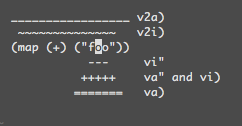
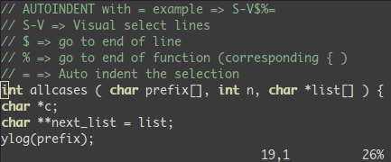
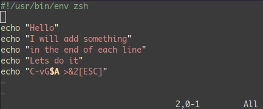

​	你想以最快的速度学习人类史上最好的文本编辑器 VIM 吗？你先得懂得如何在 VIM 幸存下来，然后一点一点地学习各种戏法。

​	Vim the Six Billion Dollar editor

> Better, Stronger, Faster.

​	学习 Vim 并且其会成为你最后一个使用的文本编辑器。没有比这个更好的文本编辑器了，非常地难学，但是却不可思议地好用。

在开始学习以前，我需要给你一些**警告**：

- 学习 Vim 在开始时是痛苦的。
- 需要时间
- 需要不断地练习，就像你学习一个乐器一样。
- 不用期望你能在 3 天内把 Vim 练得比别的编辑器更有效率。
- 事实上，你需要 2 周时间的苦练，而不是 3 天。

本文目录主要以下面四个章节编写：

- 存活
- 感觉良好
- 觉得更好，更强，更快
- 使用 VIM 的超能力

当你看完这篇文章，你会成为一个 Vim 的 SuperStar。

## 第一章 - 存活

1. 安装 [Vim](www.vim.org)
2. 启动 Vim
3. **什么也别干！**请先阅读

当你安装好一个编辑器后，你一定会想在其中输入点什么东西，然后看看这个编辑器是什么样子。但是 Vim 不是这样的，请按照下面的命令操作：

- 启动 Vim 后，Vim 在 Normal 模式下。
- 让我们进入 Insert 模式，请按下键 i。（Vim 左下角有一个 --insert-- 字样，表示你可以以插入的方式输入了）
- 此时，你可以输入文本了，就像你用“记事本”一样。
- 如果你想返回 Normal 模式，请按`ESC`键。

现在，你指定如何在 Insert 和 Normal 模式下切换了。下面是一些命令，可以让你在 Normal 模式下幸存下来：

> - `i`-> Insert 模式，按`ESC`回到 Normal 模式。
> - `x`-> 删除当前光标所在的一个字符。
> - `:wq`-> 保存 + 退出（`:w`保存，`:q`退出）
> - `dd`-> 删除当前行，并把删除的行存到`剪贴板`里
> - `p`-> 粘贴剪贴板
>
> **推荐**
>
> - `hjkl`-> 你可以使用光标键(←↓↑→)，j 对应下箭头。
> - `:help <command>`-> 显示相关命令的帮助。你也可以就输入`:help`而不跟命令。

你能在 Vim 幸存下来只需要上述的 5 个命令，你就可以编辑文本了，你一定要把这些命令练成一种下意识的状态。于是你就可以开始进阶到第二章了。

但是，在你进入第二章时，需要再说一下 Normal 模式。在一般的编辑器下，当你需要 copy 一段文字的时候，你需要使用`Ctrl`键，比如：`Ctrl-c`。也就是说，Ctrl 键就像功能键一样，当你按下了功能键 Ctrl 后，c 就不在是 c 了，而就是一个命令或是一个快捷键了，**在 VIM 的 Normal 模式下，所有的键就是功能键了。**

提示：

- 下面的文字中，如果是`Ctrl-x`我会写成`<C-x>`。
- 以`:`开始的命令你需要输入`<enter>`回车，例如：如果我写成`:q`也就是说你要输入`:q<enter>`。

## 第二章 - 感觉良好

​	上面的那些命令只能让你存活下来，现在是时候学习一些更多的命令了，下面是我的建议：所有的命令都需要在 Normal 模式下使用，如果你不知道现在在什么模式下，你就狂按几次`ESC`键。

**1. 各种插入模式**

> - `a`-> 在光标后插入
> - `o`-> 在当前行后插入一个新行
> - `O`-> 在当前行前插入一个新行
> - `cw`-> 替换从光标所在位置后到第一个单词结尾的字符

**2. 简单的移动光标**

> - `0`-> 数字零，当行头
> - `^`-> 到本行第一个不是 blank 字符的位置（所谓 blank 字符就是`空格`，`tab`，`换行`，`回车`等）
> - `&`-> 到本行行尾
> - `g_`-> 到本行最后一个不是 blank 字符的位置
> - `/pattern`-> 搜索`pattern`的字符串（如果搜索出多个匹配，可按`n`键查找下一个，`N`键向上查找）

**3. 拷贝/粘贴**（p/P 都可以，p 表示在当前位置之后，P 表示在当前位置之前）

> - `p` -> 粘贴
> - `yy` -> 拷贝当前行，相当于 `ddp`

**4. Undo/Redo**

> - `u` -> undo
> - `<Ctrl-r>` -> redo

**5. 打开/保存/退出/改变文件**

> - `:e <path/to/file>` -> 打开一个文件
> - `:w` -> 保存
> - `:saveas <path/to/file>` -> 另存为 `<path/to/file>`
> - `:x`, `ZZ` 或 `:wq` -> 保存并退出（`:x` 表示仅在需要时保存，`ZZ` 不需要输入冒号并回车）
> - `q!` -> 退出

花点时间熟悉下上面的命令，一旦你掌握了它们，你就几乎可以干其它编辑器都能干的事了。

## 第三级 - 更好，更强，更快

进行到这一步，恭喜你，你干的不错。到这我们可以开始一些更为有趣的事情了。在第三级，我们只谈那些和 vi 可以兼容的命令。

### 更好

下面，让我们看一下 Vim 是怎么重复自己的：

1. `.`-> (小数点)可以重复上一次的命令
2. `N<command>`-> 重复某个命令 N 次

下面是一个示例，打开一个文件你可以试试下面的命令：

> - `2dd` -> 删除 2 行
> - `3p` -> 粘贴文本 3 次
> - `5idesu [ESC]` -> 会写下”desu desu desu desu desu desu“
> - `.` -> 重复上一个命令 -> `5idesu [ESC]`
> - `3.` -> 重复 3 次“desu”（注意：不是 5 次，你看，Vim 多聪明啊）

### 更强

你要让你的光标移动更有效率，你一定要了解下面的这些命令，**千万别跳过**。

1. `NG` -> 跳到第 N 行（注意命令中的 G 是大写，另一种方式，使用`:N`到第  N 行，如`:99`跳到第 99 行）

2. `gg` -> 跳到第一行（相当于`1G`或`:1`）

3. `G` -> 跳到最后一行

4. 按单词移动：

   > 1. `w` -> 到下一个单词的开头。
   > 2. `e` -> 到下一个单词的结尾。
   >
   > > 如果你认为单词是由 blank 字符分隔符，那么你需要使用大写的 `E`和`W`。
   > >
   > > 

下面说下最强的光标移动：

> - `%`：匹配括号移动，包括`(`，`{`，`[`。（注意：你需要把光标先移动到括号上）
> - `*`和`#`：匹配光标当前所在的单词，移动光标到下一个（或上一个）匹配单词（*是下一个，#是上一个）

相信我，上面这三个命令对程序员来说是相当强大的。

### 更快

你一定要记住光标的移动，因为很多命令都可以和这些移动光标的命令连动。很多命令都可以如下来操作：

`<start position><command><end position>`

例如`0y$`命令意味着：

- `0` -> 先到行头
- `y` -> 从这里开始拷贝
- `$` -> 拷贝到本行最后一个字符

你可以输入`ye`，从当前位置拷贝到本单词的最后一个字符。

你也可以输入`y2/foo`来拷贝 2 个“foo”之间的字符串。

还有很多命令并不一定要按 y 才会拷贝，下面的命令也会被拷贝：

- `d`（删除）
- `v`（可视化的选择）
- `gU`（变大写）
- `gu`（变小写）
- 等等

（可视化选择是一个很有意思的命令，你可以先按`v`，然后移动光标，你就会看到文本被选择，然后，你可能d，也可能y，也可以变大写等等）

## 第四级 - Vim 超能力

你只需要掌握前面的命令，你就可以很舒服的使用 Vim 了。但是，现在，我向你介绍的是 Vim 杀手级的功能。下面这些功能是我只用 Vim 的原因。

**在当前行上移动光标：`0` `^` `$` `f` `F` `t` `T` `,` `;`**

> - `0` -> 到行头
>
> - `^` -> 到本行的第一个非 blank 字符
>
> - `$` -> 到行尾
>
> - `g_` -> 到本行最后一个不是 blank 字符的位置
>
> - `fa` -> 到下一个为 a 的字符处，你也可以 fs 到下一个为 s 的字符处。
>
> - `t,` -> 到逗号前的第一个字符。逗号可以变成其他字符。
>
> - `3fa` -> 在当前行查找第三个出现的 a。
>
> - `F` 和 `T` -> 和 `f` 和 `t` 一样，只不过是相反方向。
>
>   

还有一个很有用的命令是`dt"` -> 删除所有的内容，直到遇到双引号`"`。

### 区域选择`<action>a<object>`或`<action>i<object>`

在 Visual 模式下，这些命令很强大，其命令格式为：`<action>a<object>`和`<action>i<object>`

- action 可以是任何命令，如`d`（删除），`y`（拷贝），`v`（可以视模式选择）。
- object 可能是：`w`一个单词，`W`一个以空格为分隔的单词，`s`一个句字，`p`一个段落。也可以是一个特别的字符：`"、` `'、` `)、` `}、` `]。`

假设你有一个字符串`(map (+) ("foo"))`，而光标键在第一个`o`的位置。

> - `vi"` -> 会选择 `foo`.
>
> - `va"` -> 会选择 `"foo"`.
>
> - `vi)` -> 会选择 `"foo"`.
>
> - `va)` -> 会选择 `("foo")`.
>
> - `v2i)` -> 会选择 `map (+) ("foo")`.
>
> - `v2a)` -> 会选择 `(map (+) ("foo"))`.
>
>   

### 块操作：`<C-v>`

块操作，典型的操作：`0 <C-v> <C-d> I-- [ESC]`

- `^` -> 到行头

- `<C-v>` -> 开始块操作

- `<C-d>` -> 向下移动（你也可以使用`hjkl`来移动光标，或是使用`%`，或是别的）

- `I-- [ESC]` -> I 是插入，插入“`--`”，按 ESC 键来为每一行生效。

  

在 Windows 下的 Vim，你需要使用`<C-q>`而不是`<C-v>`，`<C-v>`是拷贝剪贴板。

### 自动提示：`<C-n>`和`<C-p>`

在 Insert 模式下，你可以输入一个词的开头，然后按`<C-p>或是<C-n>，自动补齐功能就出现了...`

### 宏录制：`qa`操作序列`q`,`@a`，`@@`

- `qa` 把你的操作记录在寄存器`a。`
- 于是`@a`会 replay 被录制的宏。
- `@@`是一个快捷键用来 replay 最新录制的宏。

> **示例**
>
> 在一个只有一行且这一行只有“1”的文本中，键入如下命令：
>
> - `qaYp<C-a>q` -> 
>   - `qa` 开始录制
>   - `Yp` 复制行
>   - `<C-a>`增加
>   - `q`停止录制
> - `@a` -> 在 1 下面写下 2
> - `@@` -> 在 2 正面写下 3
> - 现在做 `100@@`会创建新的 100 行，并把数据增加到 103.
>
> 

### 可视化选择：`v`，`V`，`<C-v>`

前面，我们看到了`<C-v>`的示例（在 Windows 下应该是`<C-q>`），我们可以使用`v`和`V`。一旦被选好了，你可以做下面的事：

- `J` -> 把所有的行连接起来（变成一行）
- `<`或`>` -> 左右缩进
- `=` -> 自动给缩进

在所有被选择的行后加上点东西：

- `<C-v>`
- 选中相关的行（可使用`j`或`<C-d>`或是`/pattern`或是`%`等）
- `$`到行最后
- `A`，输入字符串，按`ESC`。

### 分屏：`:split`和`vsplit`

下面是主要的命令，你可以使用 Vim 的帮助`:help split`。

> - `:split` -> 创建分屏（`:vsplit`创建垂直分屏）
> - `<C-w><dir>`：dir 就是方向，可以是`hjkl`中的一个，其用来切换分屏。
> - `<C-w>_`（或`<C-w>|`）：最大化尺寸（`<C-w>\`垂直分屏）
> - `<C-w>+`（或`<C-w>-`）：增加尺寸
>
> 

**文章转载地址**：[简明VIM练级攻略](https://coolshell.cn/articles/5426.html)
